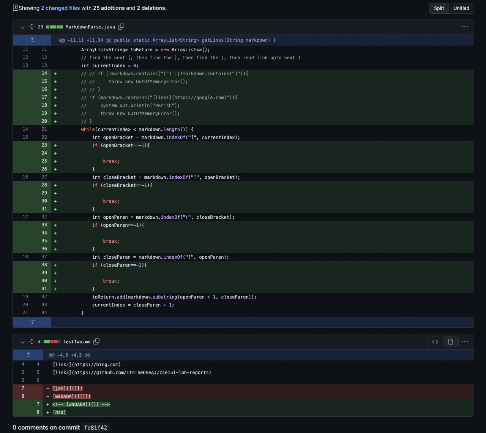

# Lab Report 2 by Jezebel Yangari

## Full Screen Shot of Changes 

## Symptom Brought by All Chnages/Inputs, Infinite Loop
> Here I used `control + C` to stop it from running.

## failure-inducing inputs
> Make sure to install VSCode onto computer. This should be done before starting. 
>Image 1 Changes

>Image 2 Changes

## 1) Installing VScode
> Make sure to install VSCode onto computer. This should be done before starting. 

## 2) Installing VScode
> Make sure to install VSCode onto computer. This should be done before starting. 

