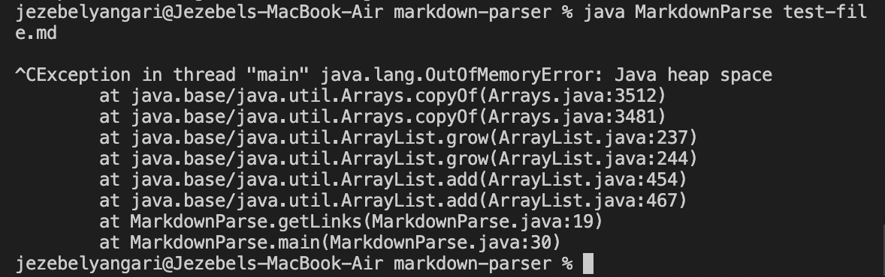
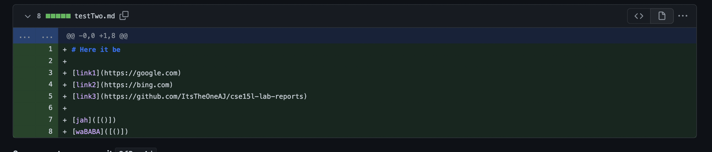
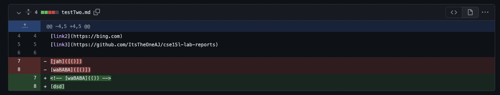
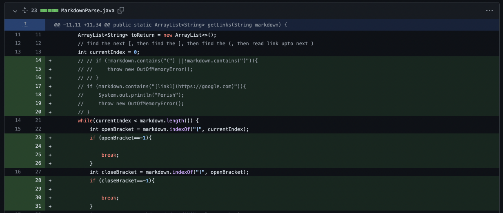
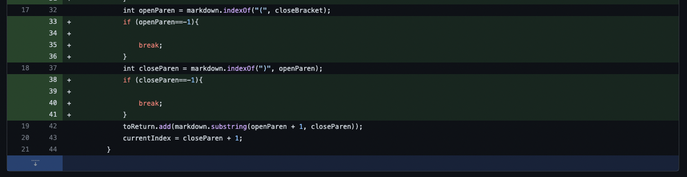

# Lab Report 2 by Jezebel Yangari

## Symptom Brought by All Chnages/Inputs, Infinite Loop
> Here I used `control + C` to stop it from running.

## failure-inducing inputs
> Make sure to install VSCode onto computer. This should be done before starting. 
>Image 1 Changes

>Image 2 Changes

## Change 1/2: 
> Adding a for Loop to break when open brakcet and close bracket are hit.
> If those brackets are at the end of the input, then it would break.
> We concluded that the reason there was an infinite loop was because the condition of the link ending was never met with repeated brackets. 

## Chnage 3:
> Make sure to install VSCode onto computer. This should be done before starting. 

