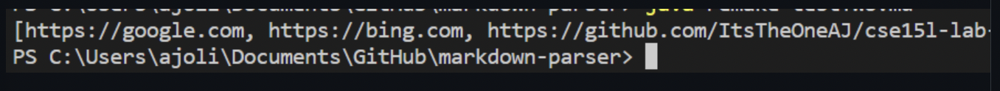

# Lab Report 2 by Jezebel Yangari

##1) First Error
> code change 1 screenshot: 

- failure inducing input: [link 1](https://github.com/ItsTheOneAJ/markdown-parser/blob/main/testTwo-copy.md)

> Variations of repeating paretheses and brackets were used to attempt to make the program fail.
- symptom: 
- relationship: The code kept looking for brackets that were not there which is why we got an infinite loop. The code did not take into account that ther might not be a bracket which was triggered by the input and caused the wrong output. The infinite loop was the major symptom that we cam eacross. Here I used `control + C` to stop it from running. This was our key identifier that told us we had not yet caught the error in the "MarkdownParse.java" file.

##2) Second Error
> code change 2 screenshot: 

- failure inducing input: [link 2](https://github.com/ItsTheOneAJ/markdown-parser/blob/main/testTwo-copy.md)

- symptom: 
- relationship: The code kept looking for brackets that were not there which is why we got an infinite loop. The idea was maybe that if the parentheses was there, it would be okay, so we break if there was not one. 

##3) Third Error
> code change 3 screenshot: 

- failure inducing input: [link 3](https://github.com/ItsTheOneAJ/markdown-parser/blob/da4b5aab32b90e930e8210f631aabaf29147fe53/testTwo.md)
- symptom: 
- relationship: The code kept looking for brackets that were not there which is why we got an infinite loop. The idea was maybe that if the parentheses and brackets was there, it would be okay, so we break if there was not one. We concluded that the reason there was an infinite loop was because the condition of the link ending was never met with repeated brackets and parentheses. The `-1` in all f the for loops is to catch if the `[]` or `()` are at the end which is the overall issue.

..https://github.com/ItsTheOneAJ/cse15l-lab-reports/blob/main/Lab-report-2.md

