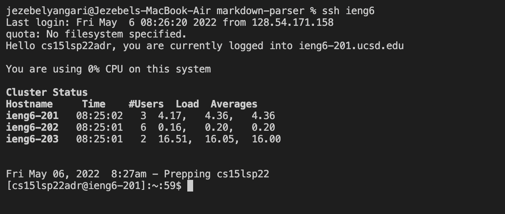
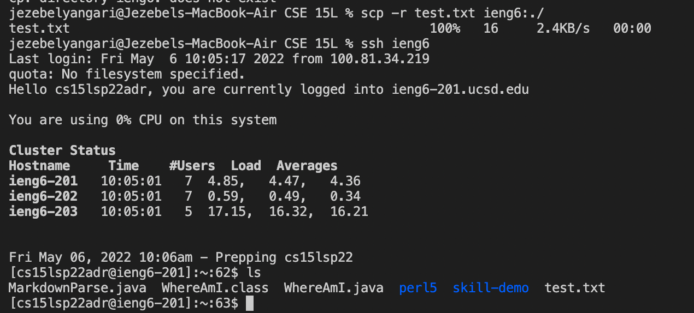

# Lab Report 3 by Jezebel Yangari

## Option 1) Streamlining ssh Configuration
>Show your `.ssh/config file`, and how you edited it (with VScode, another program, etc)

>Show the `ssh` command logging you into your account using just the alias you chose.

>Show an `scp` command copying a file to your account using just the alias you chose.

- **description:** This option creates a shortcut for logging into the ieng6 account. It also allows you to choose the shorthand alias to be implemented. This is another way to avoid having to type out the username and password for every log in.

## Option 2) Setup Github Access from ieng6
>Show where the public key you made is stored on Github and in your user account (screenshot).

>Show where the private key you made is stored on your user account (but not its contents) as a screenshot.

>Show running `git` commands to commit and push a change to Github while logged into your ieng6 account.

>Show a link for the resulting commit.
>[RESULTING COMMIT LINK](https://github.com/jezebelatucsd/markdown-parser/commit/b640e20afdfa63b524b1b0ce207824b491ec94ab)

- **description:** Here we added an SSH Key for the course specific account. This is so less logging in is needed to be done and the process can be much quicker.

## Option 3) Copy whole directories with `scp -r`
>Show copying your whole markdown-parse directory to your ieng6 account.

>Show logging into your ieng6 account after doing this and compiling and running the tests for your repository.

>Show (like in the last step of the first lab) combining `scp`, `;`, and `ssh` to copy the whole directory and run the tests in one line.

>git add

>git push

- **description:** After being able to log in to GitHub through the ieng6 account, now we needed the repository. To do this a similar method for running and compiling was done from lab 1. This was  check if the copy had worked. The entire repo was copied not just invidual files.
